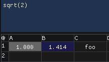
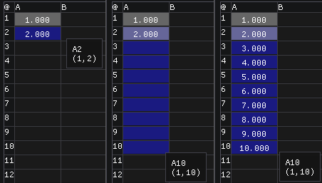
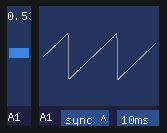

Sassy is an audio spreadsheet. It's a spreadsheet, and a synthesizer.
In order to understand what it does, it's useful to understand what
these things do.

=== Sassy as a Spreadsheet

Sassy can perform many normal spreadsheet operations. A spreadsheet
is a grid of cells, each named by its row (a number) and column (a letter).

Cells can contain text, numbers, or formulas.

The formulas in cells can refer to other cells (or even themselves) by 
their name. The first cell in top left is called A1, for first column,
first row.

Sassy has two explicit modes: edit mode and table mode. Most other
spreadsheets also have these modes, but they're not made explicit.
There are benefits and limitations to either approach.

In edit mode, you can edit the content of a cell, and Sassy can show
which cells refer to the currently edited cell (used by), as well as
which cells the edited cell refers to (uses). While in edit mode
the keyboard focus is on the text editor, so using cursor keys works
as expected.

In table mode, cursors move from cell to cell, hitting del will erase
the whole cell, and you can copy/paste one or more cells at a time.

One of the more powerful features of a spreadsheet is pasting in
table mode. All variable references get adjusted based on the offset
of your paste.

As an example, if you set A1 to value 1, and then write the formula
A1+1 in cell A2, the cell A2 gets value 2. In table mode, if you copy
cell A2 and paste it to cells A3 to A10, you'll find that the cells
get values 3,4,5,6... instead of 2, because the pasted cells' variable
references have changed.

[source]
--------------------------------------
A1+1
--------------------------------------

If you want to point at an absolute cell, you can prefix the row, column
or both with $. If A2 in example above had value $A$1+1, the paste result
would be all 2:s (after the initial 1).

[source]
--------------------------------------
$A$1+1
--------------------------------------

If you only want to lock the row, or the column, prefix just the bit
you want to lock with a $.

Formulas can contain function calls. Sassy supports a lot of functions, some that make more sense as a spreadsheet and others that make more sense as a synthesizer. For instance, you can calculate the sine of a constant:

[source]
--------------------------------------
sin(2)
--------------------------------------

Some functions take an area as a parameter. The format of an area declaration is simply two cell names combined with a colon: A1:E7. For example, to calculate the average value of a range of cells, you might do:

[source]
--------------------------------------
Average(a1:e7)
--------------------------------------

Note that everything is case-insensitive. Which is to say, it doesn't matter if you use capital letters or not.

=== Sassy as a Synthesizer

One significant difference Sassy has compared to other spreadsheets is
that it is real time.

If you write A1+1 in the cell A1, you'll find that the number increases
rather rapidly. That is because Sassy evaluates the whole spreadsheet
at sample rate. All variable references get the value from the previous
frame, so the order of cells does not matter.

In order to produce sound, you can use the out() function.

[source]
--------------------------------------
out(sin(time() * pi() * 2 * 220))
--------------------------------------

The above example takes the value Pi, multiplies it by 2 and 220, as well as current time (in seconds), passes that to sin() and finally to the output function, producing a 220Hz sine wave.

Since dealing with Pi is somewhat inconvenient, Sassy also has a simpler sine wave function with a period of 1:

[source]
--------------------------------------
out(sin1(time() * 220))
--------------------------------------

This makes things slightly easier, and it's possible to replace the sine wave with, for example, saw wave simply by changing the sin1() to saw().

If we should want to modulate the frequency, we want to adjust it in real time, but multiplying by time() won't work anymore because it would cause discontinuity in the signal; instead, we'll want to use the step() function, which works in a similar way, with the important difference of being continuous.

[source]
--------------------------------------
out(sin1(step(220)))
--------------------------------------

Note that the above still does pretty much the same thing as our first equation, but is much cleaner and has the added benefit of being able to support modulation.

Now that we've simplified our formula, let's make it more complex.

[source]
--------------------------------------
out(saw(step(220 + sin1(step(2)) * 20)))
--------------------------------------

Here we changed the sine wave to a saw wave, and modulate the frequency by a sine wave that oscillates at 2Hz.

It might be fun to see what the waveform looks like, so let's add an UI element:

[source]
--------------------------------------
graph(out(saw(step(220 + sin1(step(2)) * 20))))
--------------------------------------

This causes a graph UI element to pop up. You can adjust the sync and time scale by clicking its buttons. And since we're playing with UI elements, let's adjust that modulation with a slider:

[source]
--------------------------------------
graph(out(saw(step(220 + sin1(step(2 * slider())) * 20))))
--------------------------------------

Now a slider has popped up, and using it you'll see that the frequency of modulation changes. The slider returns a value between 0 and 1.

Since the equation is getting a bit complex, it may be useful to split it out to several cells, for example:

[source]
--------------------------------------
A1      sin1(step(2 * slider())) * 20
A2      saw(step(220 + A1))
A3      out(A2)
A4      graph(A3)
--------------------------------------

This makes it possible to organize the synthesizer in a more manageable way. A single cell can contain up to around 1000 characters. There's no real benefit in trying to fit a longer equation in a single cell.

[NOTE]
.No shortcuts
=====================================================================
Note that Sassy evaluates everything, so if a function has a side effect, it will be triggered even if the value is not used. As an example:

[source]
--------------------------------------
if(1=1, 42, out(1))
--------------------------------------

This is the spreadsheet "if" format. If the first parameter is false (a value of 0), the third parameter is returned, otherwise the second one. In this example the return value from if() is 42, but since everything is evaluated, the out() function is called, and a sample with the value 1 is sent out.
=====================================================================

Now that we have the basics covered, you may want to browse the function reference and just start playing with various functions, or read on for other features.
