Sassy supports a lot of functions, and as such they're divided into several categories. Note that there is a handy online reference built into Sassy, so if you forget just how many parameters ADSR takes and what their order is, it's all there.

=== Operators

Sassy provides most of the basic mathematical operators. These obey the normal mathematical rules where multiplications and divisions are calculated before addition and subtraction, assuming no parentheses are present.

==== Operator +
    
Adds two values together.

[source]
--------------------------------------
1+1
--------------------------------------

Produces value 2.

==== Operator -
    
Subtracts a value from another.

[source]
--------------------------------------
21-1
--------------------------------------

Produces value 20.

==== Operator *
    
Multiplies two values together.

[source]
--------------------------------------
2*3
--------------------------------------

Produces value 6.

==== Operator /
    

Divides a value from another.

[source]
--------------------------------------
4/3
--------------------------------------

Produces value 1.33333333...

==== Operator ( )
    

Parentheses can be used to alter (or enforce) calculation order.

[source]
--------------------------------------
(1+2)*3
--------------------------------------

produces value 9, while

[source]
--------------------------------------
1+2*3
--------------------------------------

produces value 7.

==== Operator < 

Less than (returns 0 or 1).
    
Primarily meant for the if() function, the < operator returns 0 for not true and 1 for true.

==== Operator >

Greater than (returns 0 or 1).

Primarily meant for the if() function, the > operator returns 0 for not true and 1 for true.

==== Operator =

Equals within 0.0001 (returns 0 or 1).
    
Primarily meant for the if() function, the = operator returns 0 for not true and 1 for true. The values can be 0.0001 apart which is generally a good idea when comparing equality of floating point values.

=== Basics

The basics set of functions contains things you will find in most projects. Input and output of samples, the if() function and time management.

==== if(test,then,else)

Returns value from "then" or "else".
    

The if() function checks if the "test" value is zero or not. If non-zero, the "then" value is returned, otherwise the "else" value is.

Note that there is not execution shortcuts, and everything is evaluated. Thus, if you have a function with a side effect, like sending a MIDI message, it will be executed, even though its return value is discarded.

==== out(sample)

Returns sample.
    
Monophonic output. If called multiple times, only one of the calls yields output. Also returns its parameter, so this call can be chained with graph(), for example.

==== out(l,r)

Returns "l".    

Stereo output. If called multiple times, only one of the calls yields output. Returns the left channel value.

==== in()

Returns captured sample.    

Monophonic input from an audio capture device. If called multiple times, returns the same sample every time.

==== in(channel)

Returns a channel of the captured sample (stereo input).
    
Stereo input. State desired channel:

[source]
--------------------------------------
in(0)
--------------------------------------

for left channel, and:

[source]
--------------------------------------
in(1)
--------------------------------------

for right channel.

==== time()

Returns the current running time, in seconds.    

Always running time value, in seconds. The heartbeat of the system.

==== time(gate)

Returns gated running time, in seconds.    

Time value that runs when the "gate" value is 1. Returns 0 otherwise.

==== dt()

Returns current, samplerate-dependent timestep.
    
The amount of time, in seconds, per sample. Useful when doing something that absolutely has to happen in single sample timeframe.

[source]
--------------------------------------
A1      a1 + dt() * (freq + freqmodifier)
--------------------------------------

If placed in cell a1, will create a clock that increases predictably. Step() is a much more convenient function to this, however.

==== step(v)

Returns continuous time that increases based on the given frequency value.

This function produces a simple way to step through waveforms with no glitches:

[source]
--------------------------------------
out(sin1(step( 220 + midipitch() * 100)))
--------------------------------------

==== step(v, gate)

Returns continuous time while gated.

This is a gated version of the step function.
    
It runs when "gate" parameter is 1, otherwise 0. Useful if you need to reset waveform.

==== trigger(v)

Returns a trigger pulse.

This function returns 1 on rising edge of the input signal, otherwise returns 0. Useful for creating trigger events.

==== trigger(v,mode)

Returns a trigger pulse.    

Returns 1 on detected edge of signal, otherwise returns 0. Operation modes:

- Mode 0: rising edge
- Mode 1: falling edge
- Mode 2: both edges
- Others: no edges

=== Signal processing

The functions in the signal processing set orbit around manipulating existing stream of audio samples, like filters and envelopes.

==== adsr(a,d,s,r,gate)

Returns an Attack/Decay/Sustain/Release envelope.

"Attack" is time to reach 1. "Decay" is time to reach sustain after attack. "Sustain" is volume level to sustain at. "Release" is time to reach zero after release.

"Gate" is either:

- 0 note is off.
- 1, level starts from current value.
- -1, level starts from 0.

Output values are within 0 and 1.

==== delay(sample,time)

Returns the delayed sample.

Buffers samples and returns them after the desired time has passed. Time is in seconds. Maximum 1 second. Modulating the time parameter may yield strange results. I dare you to try it.

==== hold(sample,time)

Returns held sample.
   
Sample and hold. Records the incoming value and keeps returning it until desired time has passed, at which point the process repeats. Time is in seconds. If the "time" parameter changes while holding, the hold may be released earlier (or later) than the original value stated.

==== hold(sample,time,mode)

Returns held sample, interpolated.

Sample and hold.

Operation modes:

- 0 works like the two parameter version. 
- 1 interpolates between old and new value for a continuous signal. 
- -1, interpolates to the wrong direction for a jaggy sawtoothy signal.

Other values between 0 and 1 return values between old and new value.

==== latch(sample, gate)

Returns the latched sample.

Latches the incoming value. Returns the value that was given on the "gate" value's rising edge.

==== filter(in,samplerate,resonance,type)

Returns the filtered sample.
    

This is a biquad resonant filter. "In" is the incoming sample, "samplerate" is the filter cutoff rate, in Hz.
"Resonance" is the sharpness of the cutoff; 1 is a good starting point.

Type is:

- 0 for low pass filter
- 1 for high pass filter
- 2 for band pass filter

==== lpf(in,samplerate,resonance)

Returns low pass filtered sample.
    
This is a biquad resonant low pass filter. "In" is the incoming sample, "samplerate" is the filter cutoff rate, in Hz.
"resonance" is the sharpness of the cutoff.

==== hpf(in,samplerate,resonance)
    
Returns high pass filtered sample.

This is a biquad resonant high pass filter. "In" is the incoming sample. "Samplerate" is the filter cutoff rate, in Hz. "Resonance" is the sharpness of the cutoff.

==== bpf(in,samplerate,resonance)

Returns band pass filtered sample.
    
This is a biquad resonant band pass filter. "In" is the incoming sample. "Samplerate" is the filter cutoff rate, in Hz. "Resonance" is the sharpness of the cutoff.

==== allpass(sample,time,feedback)

Returns allpass filtered sample.    

Buffers samples and returns them after the desired time has passed. Maximum 1 second. Can be used for delay/feedback effects.

==== comb(sample,time,damp,feedback)

Returns comb filtered sample.
    
Buffers samples and returns them after the desired time has passed. Maximum 1 second. Can be used for delay/feedback effects.

==== reverb(sample,roomsize,damp,freeze)

Returns reverb filtered sample.
    
Emulates sound reverbing in a room. Rather heavy. Set "freeze" to 1 to keep reverberating the current data.
The output is full wet signal, mix in some of the dry for more pleasing results.

==== rubberband(sample,strength)

Returns rubberband filtered sample.
    
Calculates:

[source]
--------------------------------------
v = (v + oldvalue * strength) / (strength + 1)
--------------------------------------

Causes output value to approach input value with a delay. Larger strength values make approach slower. Useful to force non-continuous signals to become continuous.

==== dc(sample)

Returns detected direct current.    

Calculates running average of samples over 1s, practically detecting any existing dc. Useful for removing bias from signal.

=== Waveforms

Sassy provides a bunch of waveform generating functions. For most, the period is 0..1 and amplitude -0.5..0.5, making it easy to switch between them.

==== noise()

Returns random value.

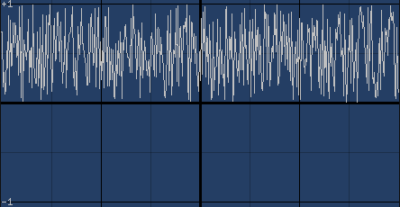

Pure white noise giving random numbers between 0 and 1.

==== pinknoise()

Returns random value.
    
Pink noise (equal weights to octaves) giving random numbers between 0 and 1.

==== brownnoise()
    
Returns random value.

Brown noise (more weight to high octaves) giving random numbers between 0 and 1.

==== bluenoise()
    
Returns random value.

Blue noise (more weight to low octaves) giving random numbers between 0 and 1.

==== paranoise(10 args)
    
Returns random value.

Custom set of weights for noise octaves, giving random numbers between 0 and 1.

Parameter 1 is weight for a value that changes on every sample, parameter 2 for every second sample, parameter 3 for every 4th, parameter 4 for every 8th, etc.

==== pulse(val, duty)

Returns pulse wave.    

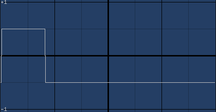

Pulse wave with output of -0.5 or 0.5. "Duty" is a value between 0 and 1 which tells how much of the pulse should be high (or low). This is a mathematically pure wave, and as such may be too "harsh". Some low pass filtering is
recommended to help with aliasing.

==== sin1(val)

Returns a sine wave. 

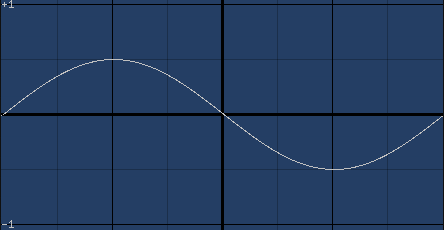

This is a sine wave with period of 0..1 instead of 0..2*pi for convenience, so this can be dropped in place of
other waveforms. The output range is also -0.5..0.5 for the same reason.

==== square(val)

Returns a square wave.    

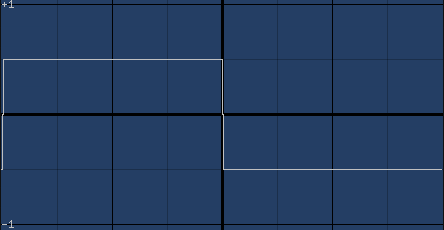

Square wave with period of 0..1 and output of -0.5 or 0.5. This is equal to pulse wave with duty of 0.5. This is a mathematically pure wave, and as such may be too "harsh". Some low pass filtering is recommended to help with aliasing.

==== squareq(val)

Returns an antialiased square wave.

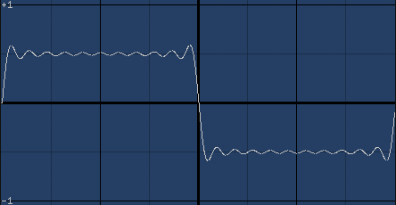

This is a square wave built out of bunch of sine waves. As such this is heavier to compute, but smoother
sounding than the 'raw' square wave.

==== squareq(val,o)

Returns an antialiased square wave.    

This is a square wave built out of bunch of sine waves. Parameter "o" states how many sines to use. squareq uses 10.
As such this is heavier to compute, but smoother sounding than the "raw" square wave.

==== saw(val)

Returns a saw wave.    

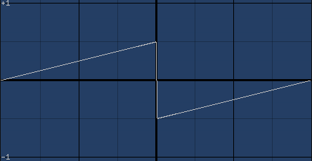

This is a saw wave with period of 0..1 and output of -0.5 or 0.5. This is a mathematically pure wave, and as such
may be too 'harsh'. Some low pass filtering is recommended to help with aliasing.

==== sawq(val)

Returns a saw wave.    

image::images/waves/sawq.png[]

This is a saw wave built out of bunch of sine waves. As such this is heavier to compute, but smoother
sounding than the 'raw' saw wave.

==== sawq(val,o)
    
Returns a saw wave.

This is a saw wave built out of bunch of sine waves. Parameter "o" states how many sines to use. sawq uses 14.
As such this is heavier to compute, but smoother sounding than the "raw" saw wave.

==== triangle(val)

Returns a triangle wave.

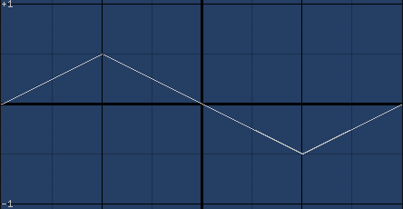

This is a triangle wave with period of 0..1 and output of -0.5..0.5.

==== supersaw(val,s,d)

Returns a supersaw wave.    

image::images/waves/supersaw.png[]

This is three octaves of saw wave with scaling and detuning. "Val" is the incoming value, "s" is scale per octave, or how much quieter (or louder) each octave should be. 0.75 is a nice value to start with. Finally, "d" is detuning value, start from 0.

Since several octaves are summed, the amplitude may not fit within -0.5..0.5.

==== supersquare(val,s,d)
    
Returns a supersquare wave.    

image::images/waves/supersquare.png[]

This is three octaves of square wave with scaling and detuning. "Val" is the incoming value, "s" is scale per octave, or how much quieter (or louder) each octave should be. 0.75 is a nice value to start with. Finally, "d" is detuning value, start from 0.

Since several octaves are summed, the amplitude may not fit within -0.5..0.5.

==== supersin(val,s,d)
    
Returns a supersin wave.    

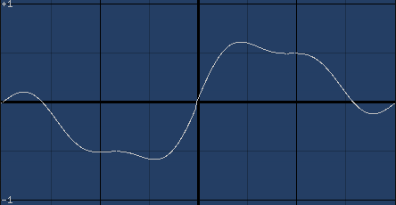

This is three octaves of sin1 wave with scaling and detuning. "Val" is the incoming value, "s" is scale per octave, or how much quieter (or louder) each octave should be. 0.75 is a nice value to start with. Finally, "d" is detuning value, start from 0.

Since several octaves are summed, the amplitude may not fit within -0.5..0.5.

==== squaresaw(val,f)
    
Returns a... wave.

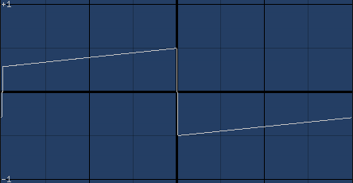

Is it a saw? Is it a square? It's both!

- 0 makes it a saw
- 1 makes it a square
- 2 makes it a sin1

Values between interpolate between the waveforms.

==== opl1(val)

Returns opl style 1 wave.

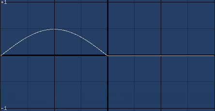

This is an "AdLib"-style waveform (half wave). Amplitude is 0..0.5.

==== opl2(val)
    
Returns opl style 2 wave.

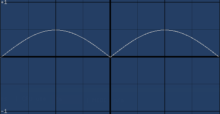

This is an "AdLib"-style waveform (abs sin wave). Amplitude is 0..0.5.

==== opl3(val)
    
Returns opl style 3 wave.

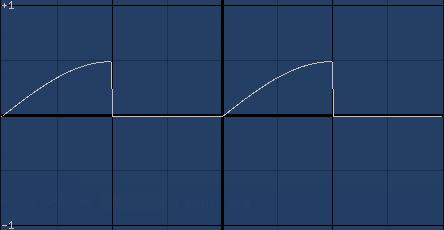

This is an "AdLib"-style waveform (two quarter waves). Amplitude is 0..0.5.

==== drunkardswalk(step,gate)

Returns a predictably random value within 0..1.

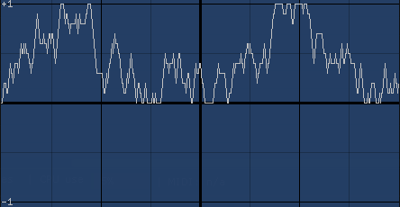

This is a random pattern that, on every step gate is 1, makes a random choice of four options:

- increase by step amount
- decrease by step amount
- remain at current value
- repeat previous choice

=== User interface

Sassy has a bunch of functions that produce user interface elements. The visual components return their inputs, so they are easy to chain. For the user input elements with variants that take initial values, Sassy is able to modify the initial value at runtime, so when you save a spreadsheet the sliders and toggles stay where you left them.

==== bar(val)

Returns val.

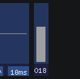
    
Creates an user interface bar component which shows a value between 0 and 1 in a bar form. Returns the input value, so this can be chained.

==== fft(val)

Returns val.

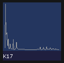

Creates an user interface fft component which can be used to analyze the waveform. Or, more likely, admired, while
nodding sagely. Returns the input value, so this can be chained.

==== button()

Returns 0 or 1 depending on whether button is pressed.

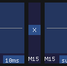

Creates an user interface button component that, while pressed, returns 1, otherwise returns 0.

==== graph(val)
    
Returns val.

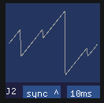

Creates an user interface graph component (or 'scope') which can be used to analyze the waveform. Also allows changing of sync and time scale of display. Returns the input value, so this can be chained.

==== plotxy(x,y)

Returns x.

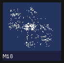

Creates an user interface graph component that draws points in (x,y) coordinates.

==== plotxy(x)    

Returns x.

Creates an user interface graph component that draws points in (x,previous x) coordinates.
    
==== probe(v)

Returns v.    

Sends value to be analyzed in the scope window for closer analysis, channel 0.

==== probe(ch,v)

Returns v.
    
Sends value to be analyzed in the scope window for closer analysis, channel Ch. Valid values are 0, 1, 2 and 3.

==== slider()

Returns value between 0 and 1.

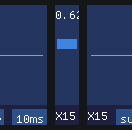
    
Creates an user interface slider component that can be used to produce values between 0 and 1.

==== slider(val)

Returns value between 0 and 1.
    
Creates an user interface slider component that can be used to produce values between 0 and 1, which is set to val on startup.

==== sliderpot(idx)

Returns value between 0 and 1.    

Creates an user interface slider component that can be used to produce values between 0 and 1.
Index refers to MIDI pot number, so this slider can be controlled via UI or a MIDI controller.

==== sliderpot(idx, val)

Returns value between 0 and 1.    

Creates an user interface slider component that can be used to produce values between 0 and 1.
Index refers to MIDI pot number, so this slider can be controlled via UI or a MIDI controller.
Slider is set to "val" on startup.

==== toggle()

Returns 0 or 1.    

Creates an user interface toggle component that, while active, returns 1, otherwise returns 0.

==== toggle(val)

Returns 0 or 1.    

Creates an user interface toggle component that, while active, returns 1, otherwise returns 0.
Toggle is set or cleared on startup based on the "val" parameter.

==== togglepot(idx)
    
Returns 0 or 1.
    
Creates an user interface toggle component that, while active, returns 1, otherwise returns 0.
Index refers to MIDI pot number, so this slider can be controlled via UI or a MIDI controller.

==== togglepot(idx,val)
    
Returns 0 or 1.
    
Creates an user interface toggle component that, while active, returns 1, otherwise returns 0.
Index refers to MIDI pot number, so this slider can be controlled via UI or a MIDI controller.
Toggle is set or cleared on startup based on the "val" parameter.

=== MIDI interface

Sassy can receive and send MIDI messages. In order to avoid overloading the MIDI output, sassy limits the output rate. This rate can be edited in preferences.

==== midinote()

Returns MIDI note number (0..127).
    
Returns most recently received MIDI note value.

==== midinote(ch)

Returns MIDI note number for channel (0..127).
    
Polyphonic MIDI in. Returns MIDI note value for the channel. Channels are allocated by order of arrival.

==== midiprog()

Returns MIDI program number (0..127).    

Returns most recently received MIDI program value.

==== midion()

Returns MIDI note on (0 or 1).    

Returns 0 or 1 depending on whether a note is being pressed.

==== midion(ch)

Returns MIDI note on for channel.    

Polyphonic MIDI in. Returns 0 or 1 depending on whether a note is being pressed. Channels are allocated by order of arrival.

==== midipitch()

Returns MIDI pitch bend (0..1).    

Returns most recently received MIDI pitch bend value. This is uses the whole 14 bit precision to generate a value between 0 and 1. 0.5 is the resting position.

==== midipot(potno)

Returns midi pot (modulation control) value (0..1).
    
Returns most recently received MIDI pot (or mod wheel) value. To know which pot number to use, use the controller and see what number is reported. 

==== midipot(potno, val)

Returns midi pot (modulation control) value (0..1).
    
Returns most recently received MIDI pot (or mod wheel) value. To know which pot number to use, use the controller and see what number is reported. 

"Val" specifies the initial value.

==== midival()

Returns MIDI note as frequency (Hz).    

Returns the most recently received MIDI note value converted to frequency.

==== midival(ch)

Returns MIDI note as frequency (Hz) for channel.
    
Polyphonic MIDI in. Returns channel's MIDI note value converted to frequency. Channels are allocated by order of arrival.

==== midivel()

Returns MIDI note frequency (0..1).

Returns the most recently received MIDI note velocity, including aftertouch.

==== midivel(ch)

Returns MIDI note frequency (0..1) for channel.

Polyphonic MIDI in. Returns channel's MIDI note velocity, including aftertouch. Channels are allocated by order of arrival.

==== midiout(note,vel)

Returns note.    

- Sends note on when velocity is above 0.
- Sends polyphonic aftertouch if velocity changes.
- Sends note off if velocity is 0.
- Sends note off if note changes.
- If parameters stay the same, doesn't send anything.

All midi out sends depend on rate limiting; if too many midi messages have been sent out, the new ones are simply not sent. Most functions will attempt again later until sent.

==== midioutpot(value,pot)
    
Returns value.

Sends pot (or modulation control) value (0..1) if changed.

All midi out sends depend on rate limiting; if too many midi messages have been sent out, the new ones are simply not sent. Most functions will attempt again later until sent.

==== midioutprog(prog)

Returns prog.    

Sends MIDI program change value if changed.

All MIDI out sends depend on rate limiting; if too many midi messages have been sent out, the new ones are simply not sent. Most functions will attempt again later until sent.

==== midioutraw(gate,a,b,c)
    
Returns gate.

Sends raw 3-byte midi message if gate is 1. The values are completely unchecked. Use trigger() to only try sending once, instead of spamming the midi output indefinitely.

All midi out sends depend on rate limiting; if too many midi messages have been sent out, the new ones are simply not sent. Most functions will attempt again later until sent.

=== Math

Since this is a spreadsheet, you can find all the basic math functions you can expect.

==== abs(val)

Returns absolute of val.
   
[source]
---------------------------
abs(-1) = 1
abs(1) = 1
abs(nan) = nan
---------------------------

==== floor(val)
    
Returns val rounded down.

[source]
---------------------------
floor(0.7) = 0
floor(1.3) = 1
---------------------------

==== fract(val)

Returns fractional part of val. Counterpart to trunc().
    
[source]
---------------------------
fract(0.7) = 0.7
fract(1.3) = 0.3
---------------------------

==== freqtonote(val)

Returns MIDI note value of a frequency.
    
Turns Hz into midi note values. Not guaranteed to be an integer value. This calculates:

[source]
---------------------------
12 * log(32 * pow(2, 3/4.0) * (freq/440)) / log(2)
---------------------------

==== mix(val,a,b)

Returns mix of a and b based on val.    

If val is 0, returns a. If val is 1, returns b. Interpolates between a and b. If val is outside 0..1 range, the result is extrapolated.

==== log(val)

Returns natural logarithm of val.

==== log10(val)

Returns base-10 logarithm of val.

==== mod(val, divisor)

Returns modulo of val and divisor.    

Like the clock. mod(20, 12) = 8 (pm).

==== notetofreq(val)

Returns the frequency of a MIDI note.
    
Turns midi notes into Hz. This version of the function is based on a precalculated table, and as such only handles integer note values. If you need sub-note frequencies, use notetofreqslow().

==== notetofreqslow(val)

Returns the frequency of a MIDI note.
    
Turns midi notes into Hz.
This version of the function calculates:

[source]
---------------------------
pow(2, (note - 69) / 12) * 440
---------------------------

'Pow' is a very expensive operation on intel architectures, and its runtime depends on the input values.

==== exp(val)

Returns the exponential function of val.

==== pi()
    
Returns the constant Pi. Useful in trigonometry.

==== pow(x,y)

Returns the x to the power of y.
   
[source]
---------------------------
pow(2,4) = 2 * 2 * 2 * 2.
---------------------------

Note that this is a surprisingly expensive operation, at least on intel architectures.

==== sqrt(val)

Returns the square root of val.    

==== trunc(val)

Returns the integer part of val. Counterpart to fract().
    
[source]
---------------------------
trunc(0.7) = 0
trunc(1.3) = 1
---------------------------

==== quantize(val)

Returns val hz quantized to MIDI note value hz.    

Basically same as turning Hz into note values, getting the integer value, and then going back.

==== isnan(val)

Returns 0 or 1    

Checks if the value is nan, and returns 1 if so.

==== nan()    

Returns nan. Which is not a number. Or error state. Or is. I mean.

==== nankill(val)

Returns val or 0 if val was nan.    

Cleans up nans in samples. May be useful sometimes.

==== even(val)

Returns 1 if integer of val is divisible by 2.

==== odd(val)

Returns 0 if integer of val is divisible by 2.

==== sign(val)

Returns  -1 if val is < 0, otherwise 1.

==== smoothstep(val)

Returns smoothstepped value.    

Calculates:

[source]
---------------------------
x * x * (3 - 2 * x)
---------------------------

Assumes val is within 0..1.

==== smootherstep(val)

Returns smootherstepped value.

Calculates:

[source]
---------------------------
x * x * x * (x * (x * 6 - 15) + 10)
---------------------------    

Assumes val is within 0..1.

==== min(a,b)

Returns the smaller of a or b.

==== max(a,b)

Returns the larger of a or b.

==== clamp(v,a,b)

Returns v clamped between a and b.    

a is assumed to be smaller than b.

==== map(v,a,b,c,d)

Returns v mapped from a..b to c..d.
    
a is assumed to be smaller than b, and c smaller than d. If v is ouside a..b range, the results are extrapolated.

=== Trigonometry

And of course there's a set of trigonometric functions, because why not.

==== degrees(val)  

Returns val converted from radians to degrees.

==== radians(val) 

Returns val converted from degrees to radians.

==== acos(val)

Returns arc-cosine of val.
    
==== asin(val)

Returns arc-sine of val.

==== atan(val)

Returns arc-tangent of val.

==== atan2(x,y)

Returns arc-tangent of x/y.

==== cos(val)

Returns cosine of val.

==== cosh(val)

Returns hyperbolic cosine of val.

==== sin(val)

Returns sine function of val (with period 0..2*pi).

==== sinh(val)

Returns hyperbolic sine of val.

==== tan(val)

Returns tangent of val.

==== tanh(val)

Returns hyperbolic tangent of val.

=== Table functions

Being a spreadsheet, Sassy naturally has a suite of table functions. These can be convenient ways to cover several cells in a single function call, calculate the average spending per day, or can be handy for step sequencing.

==== min(area)

Returns the minimum value in the area.
    
Scans area for numeric values and returns the smallest one found.

==== max(area)

Returns the maximum value in the area.    

Scans area for numeric values and returns the biggest one found.

==== average(area)

Returns the average of values in the area.    

Scans area for numeric values and returns the average of the values found.

==== sum(area)

Returns the sum of values in the area.
    
Scans area for numeric values and returns the sum of the values found.

==== product(area)

Returns the product of values in area.
   
Scans area for numeric values and returns the product of the values found. I.e, multiplies them together.

==== count(area)

Returns the number of values in area.
    
Scans area for numeric values and returns the number of values found.

==== find(area, v)

Returns index of a value in area.    

Scans area for the desired value and returns the index of the first one found. Returns nan if not found.
This is the counterpart to select().

==== findv(area, v)

Returns the index of a value in area
    
Scans area for the desired value and returns the index of the first one found. Returns nan if not found.
This is the counterpart to selectv().

==== select(area,v)

Returns the selected value in area.
    
Scans area for numeric values in typewriter order (left to right row by row, top down) and returns the
Nth value, where N is integer part of v modulo the number of cells in the area.

Which sounds more complicated than it is. 

Handy for sequencing.

==== selectv(area,v)

Returns the selected value in area.    

Scans area for numeric values in column order (top down column by column, left to right) and returns the Nth value, where N is integer part of v modulo the number of cells in the area.

Which sounds more complicated than it is.

Handy for sequencing.

==== hilight(row,col)

Returns row.

Hilights the specified cell. Just a visual thing.    

==== hilight(row,col,rgb)

Returns row.

Hilights the specified cell. Just a visual thing.    

Third value specifies the color of the hilight, specially encoded using the rgb function:

[source]
---------------------------
hilight(7,12,rgb(1,0.5,0.25))
---------------------------

==== lookup(row,col)

Returns the value of the specified cell.

==== replace(row,col,val)

Returns row.
  
This function is potentially dangerous. It *will* replace whatever is in target cell. Only use it if you know what you're doing. For a bit of safety, use rowof() and columnof() to specify the target cell.

[source]
---------------------------
replace(rowof(A1),columnof(A1),0.7)
---------------------------

==== rowof(cell)

Returns the numeric index of a cell.
    
This function returns the numeric row index of a cell. This can be useful in hilighting or replacing cell content.

==== columnof(cell)

Returns the numeric index of cell.
    
This function returns the numeric column index of a cell. This can be useful in hilighting or replacing cell content.

=== Boolean operations

If the if() clauses get a bit complicated, a bit of logical boolean operations may be helpful.

==== and(a,b)

Returns 1 if both are 1, else 0.    

Technically, anything over 0.0001 is considered 1.

==== or(a,b)

Returns 1 if either are 1, else 0.
    
Technically, anything over 0.0001 is considered 1.

==== xor(a,b)

Returns 1 if one of a and b is 1, else 0.    

Technically, anything over 0.0001 is considered 1.

==== not(a)

Returns 1 a is 0, else 0.    

Technically, anything over 0.0001 is considered 1.

==== true()

Returns 1.

==== false()
    
Returns 0.

=== Binary operations

A bunch of binary boolean operations is supported, as it turns out you can do all sorts of funny sounds by shuffling bits around. To avoid confusion with the "logical" boolean operations, these are prefixed with b_. If you're looking for these, you probably know what you're doing.

The b_functions are binary ops and work on integer values. Any fractions are discarded.

==== b_and(a,b)

Returns a & b.    

Calculates bitwise and of a and b. 

==== b_or(a,b)

Returns a | b.
    
Calculates bitwise or of a and b.

==== b_xor(a,b)

Returns a ^ b.
    
Calculates bitwise xor of a and b.

==== b_not(a)

Returns ~a.
    
Negates bits in a.

==== b_nand(a,b)

Returns ~(a & b).
    
Calculates bitwise nand of a and b.

==== b_nor(a,b)

Returns ~(a | b).
    
Calculates bitwise nor of a and b.

==== b_shleft(v,amt)

Returns v << amt.    

Shifts bits to the left.

==== b_shright(v,amt)

Returns v >> amt.
    
Shifts bits to the right.
Negative values are not bit-extended.

==== b_rotleft(v,amt,bits)

Returns (v << amt) | (v >> (bits-amt)).
    
Rotates bits to the left. Overflowing bits return from the left.
Third parameter is optional; default is 32.

==== b_rotright(v,amt,bits)

Returns (v << amt) | (v >> (bits-amt)).    

Rotates bits to the right. Underflowing bits return from the left.
Third parameter is optional; default is 32.

==== b_test(v,bit)

Returns 1 if bit is on.
    
Check if indexed bit is on.

==== b_set(v,bit)

Returns value with bit set.    

Set indexed bit in value.

==== b_clear(v,bit)

Returns value with bit cleared.
    
Clear indexed bit in value.

