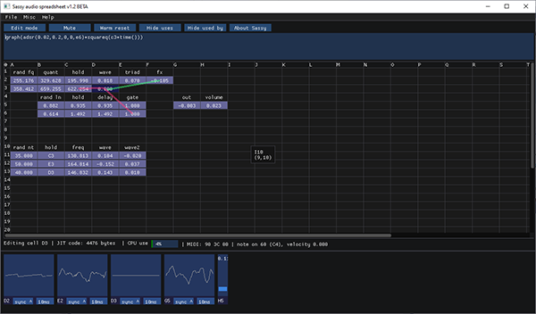
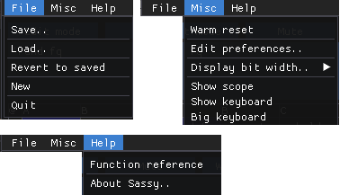
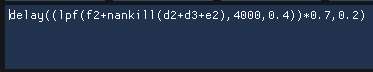
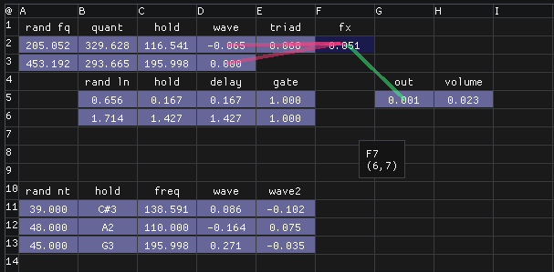
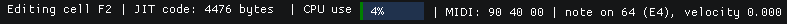
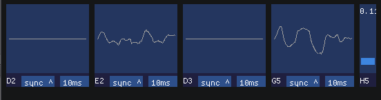
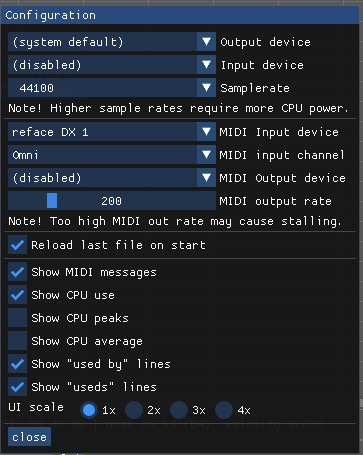
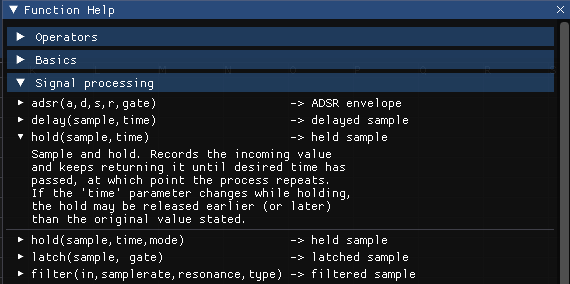
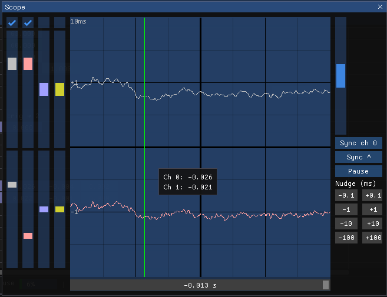
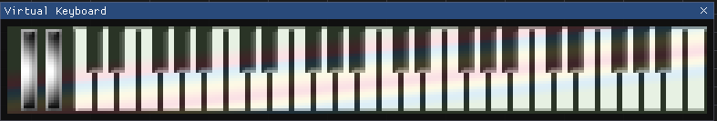

=== Main UI

The main view in Sassy is split into six segments, top-down:

- Menu bar
- Button strip
- Formula edit box
- Spreadsheet
- Status
- UI widgets

==== Menu bar

The file menu contains the usual suspects - save, load, revert, new and quit. There's no warning dialogue, so if you hit "new", your current data is gone. Saving and loading pop up the system dependent file dialogs.

The misc menu contains various things that may move as the software develops further.

Warm reset clears the current state and restarts, without removing any cell data. It's pretty much the same as if the spreadsheet was just loaded off disk.

Edit preferences goes to the configuration dialog.

Display bit width lets you adjust how the "binary" cell format looks like.

Show scope shows the scope window, and show keyboard shows the virtual midi keyboard. Big keyboard toggles between normal and zoomed version of the virtual midi keyboard.

==== Button Strip

The button strip contains quick access to some often used functions.

Edit mode / table mode button switches between the spreadsheet modes. The mode changes automatically when certain things are done, so this is not as useful button as one might think at first. If you drag to select cells, mode changes to table mode, and if you start typing, mode changes to edit, for example.

Mute / unmute button stops audio output, which may be useful at times. It does not stop MIDI messages from being sent out, though.

Warm reset clears the current state and restarts, without removing any cell data. It's pretty much the same as if the spreadsheet was just loaded off disk.

Show/hide uses and show/hide used by buttons enable or disable the uses/used by overlay in edit mode.

About Sassy opens the Sassy info dialog box.

==== Edit Box

The edit box is a basic text editor. The maximum number of characters in a single cell is about a thousand, but for clarity it's better to split formulas into several cells.

<<<

==== Spreadsheet

The spreadsheet proper is split into cells. The color of the cells gives information on the type of data in the cell. Black background means it's either empty or text cell. Text cells are (currently) purely decorative. Grey background means the data in the cell is static, and does not need to be re-evaluated. Static data is usually just plain numbers, or equations with no dynamic content (such as sqrt(2 * 7) - Sassy knows how to calculate that once and just store the result).

On top of the cells there are some green and red lines. These lines show what cells are used by or which cells use the current cell. These overlay lines can be enabled or disabled through the button bar or preferences dialog.

==== Status 

The status bar shows various bits of information, which can be configured through the preferences dialog. The most useful bit is the MIDI message display, which shows the most recent MIDI message received. This can be used to see which MIDI pot (or modulation control) is used in a MIDI controller.

==== UI Widgets

Finally, at the bottom are UI widgets which get generated whenever a cell contains a function that requires one, such as graph() or slider().

=== Preferences

The preferences dialog lets you configure Sassy's behaviour, as well as the input/output devices.

From top down:

- Output device is the audio device used for audio output. Defaults to whatever is the system default.
- Input device is the one used to capture audio to be read with the in() function call. Disabled by default.
- Samplerate directly affects CPU use, so if the spreadsheet you're trying to use is too heavy, try dropping the sample rate.
- MIDI input device is the device to listen to for MIDI messages. Disabled by default. 
- MIDI input channel is either omni to listen to whatever MIDI channel, or a specific one to discard messages from any other channels. Omni by default.
- MIDI output device is the device to send MIDI messages to. Disabled by default.
- MIDI output rate is in messages per second. Too high rates may cause problems with some devices.

[NOTE]
.On Device Names
=====================================================================
Sassy opens MIDI devices (as well as audio devices) based on the name string.

The way RtMidi works, the devices get an unique name by including the (windows) device number after the device name. This means that if you plug in new MIDI devices, the unique names may change, and you need to select them again.

The unique names are needed because, who knows, maybe you'll connect five WaveStates to your PC?
=====================================================================

- Reload last file on start does what it says - saves you from going through the file dialog if you keep working on a single spreadsheet over several sessions.
- Show midi messages shows or hides the MIDI messages in the status bar.
- Show CPU use shows the current CPU use, which is calculated based on how much time it took to generate how many samples. This can spike quite a bit, which is just how PCs work.
- Show CPU peaks underlines the above problem.
- Show CPU average is how most programs show the CPU use.
- Show "used by" lines shows or hides the "used by" overlay.
- Show "useds" lines shows or hides the "useds" overlay.
- UI scale can be used to scale the whole user interface up by some factor, for people with higher resolution screens.

[NOTE]
.On CPU Use
=====================================================================
Windows is not a real time operating system. There's no performance guarantees, so whatever you're doing, it's going to be interrupted every now and then. Thus, the CPU use will spike, and there's pretty much nothing we can do about it. The thread priority for audio generation is set to something crazy high, and it should tell Windows just to leave us be and crunch our numbers, but that's still not enough.

So the CPU use will spike. Due to buffering, momentarily going under 100% should not cause problems.

If the flashing CPU use irritates you, you can disable it, or switch to the CPU average display. That's what other programs (apparently) do.
=====================================================================

<<<

=== Function Reference

The function reference is a handy collapsing list reference of all the functions in Sassy. Overview list shows the parameters and return value, and clicking on a function gives further information.

=== Scope

When the little graph widget isn't enough, there's the scope window. The scope has 4 inputs and can capture 10 seconds of data.

On the left side, there's two sliders and a checkbox per input channel. The checkbox can be used to enable or disable the input. The upper slider changes the scale of the input (from 1/16x to 16x), and the bottom slider changes the Y offset of the input.

In the middle is the scope itself, with the channels drawn in different colors. When hovering over the scope with a mouse, the green vertical line is shown, with a tooltip showing the value of different channels at that point.

Below the scope is a bar with which the display offset can be changed when in pause mode.

On the right, scroll bar changes the time scale from 0.1ms up to 1000ms. When the scale is low enough, discrete samples are shown on the scope. (at 44.1kHz this happens at 1ms scale).

Below the slider there are several buttons. First button lets you choose which input channel to use for sync, second chooses between rising edge, falling edge or disabled sync. Pause/capture button changes between recording input or going into pause mode where the captured data can be looked at.

Below these are a bunch of nudge buttons which can be used to scroll the data in pause mode in finer steps than is possible with the big slider.

=== Virtual Keyboard

The virtual keyboard can be used to send MIDI messages to Sassy. While it's not really usable for playing (unless you just want to wipe up and down a keyboard), it's handy for generating test data when an actual midi controller is not available. Mod wheel and pitch bend are also included.

You can toggle between a tiny and a big keyboard via the misc menu.
